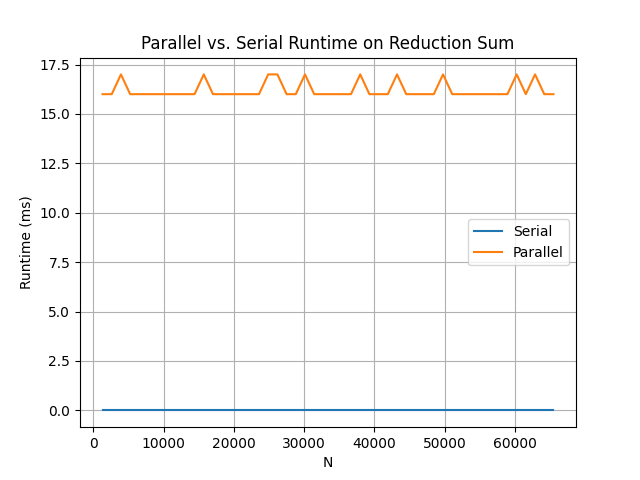

# cuda-programming

## Overview

This repository contains various algorithms implemented using CUDA for parallel processing. My goal is to explore and experiment with parallelization techniques in CUDA across different types of algorithms. Each algorithm will be added as an independent module, and the repository will be updated with new implementations over time.  

I am by no means an expert in CUDA (or C++), and do not claim that my solutions are optimal or well written. If you see any room for improvement feel free to message me or make a pull request implementing the fix with a detailed explanation. Upon receiving either I will fix the issue and give you credit in a comment!

## Prerequisites
- **Hardware & Software Requirements**
  - Latest version of CUDA (as I am writing this it is 12.9)
  - NVIDIA GPU with CUDA capability (I use an RTX 2000 Ada which has CUDA capabililty 8.9)
- **Dependencies**
  - Python Libraries (For runtime plotting notebooks): matplotlib
 
## Installation
1. Fork this repository
2. Clone the repository
   ```bash
   git clone https://github.com/{Your GitHub Username}/cuda-programming
   ```
3. Navigate to the local repository
   ```bash
   cd ./cuda-programming
   ```
4. Navigate to any of the folders, e.g. hello_cuda
   ```bash
   cd ./hello_cuda
   ```
5. Compile with NVCC
   ```bash
   nvcc -o your_cuda your_cuda.cu
   ```
## Usage
Run the binary with input from a file. Currently, input to all of my programs is simply an integer denoting the size of the randomly generated input array to the given algorithm.
```bash
cat input.txt | ./your_cuda
```
Input can also be given via user input by running
```bash
./your_cuda
```
The program will wait for you to input a number on the newline.

## Table of Contents
1. [Vector Addition](#vector-addition)
2. [Parallel Reduction](#parallel-reduction)

## Vector Addition

  
### Code
The serial algorithm I wrote to compare to a parallel implementation used a simple for loop.

```c++
void addVectorsSerial(int *a, int *b, int *c, int vectorLength) {
    for (int i = 0; i < vectorLength; i++) {
        c[i] = a[i] + b[i];
    }
}
```

The CUDA kernel itself was quite simple, requiring only pointers to the input and output arrays and the size of the arrays.
```c++
__global__ void addVectorsParallel(int *a, int *b, int *c, int N) {
    int i = threadIdx.x + blockIdx.x * blockDim.x;
    if (i < N) {
        c[i] = a[i] + b[i];
    }
}
```
The first line of the kernel calculates its thread index. If the kernel is assigned an index within the array, it performs the addition. I couldnt find a way to avoid this check without giving up the property that the input array could be of arbitrary size. Reach out to me or make a pull request with an explanation if such a solution exists!  

The call to the CUDA kernel was as follows:

```c++
addVectorsParallel<<<sizeof(parallelOut) / 1024 + 1, 1024>>>(pa, pb, pOut, N);
```

One block for each multiple of 1024, plus 1 for any remainder, was called with 1024 threads.

## Parallel Reduction (Sum)
### What is it?
Say you have a list of integers
```c++
    int nums[] = {1, 2, 3, 4, 5, 6, 7};
```

For many problems, it can be useful to **reduce** such a list of numbers down to a single value (their sum, product, max, min, etc.). In the case of the array above, the reduced sum would be equal to $28$, the reduced maximum would be equal to $7$, the reduced product would be equal to $7! = 5040$, etc.

I specifically wrote a reduction *sum*, the choice of which was arbitrary and could be easily changed to any other binary operation.

### My First Implementation



My first attempt at parallelization computed the sum correctly, but took orders of magnitude longer than the simple serial sum. I cannot say exactly what caused this poor performance, but I am fairly confident that it had to do with the choice I made to make the kernel run recursively (not advisable for code that will run on a GPU).

### Second Attempt Using CUDA Libraries


Having struggled with writing the parallel reduction from scratch, I decided to take a step back and learn some more CUDA. I began with NVIDIA's [CUDA Made Easy](https://github.com/NVIDIA/accelerated-computing-hub/tree/main/gpu-cpp-tutorial) course from the [NVIDIA Accelerated Computing Hub](https://github.com/NVIDIA/accelerated-computing-hub/tree/main), which began by teaching CUDA's Thrust library. The Thrust library provides a variety of standard pre-written functions (reduce, transform, etc.) which can be used and combined to implement various algorithms in parallel without having to write them in raw CUDA completely from scratch.

#### Code
```c++
long serialSum(const thrust::universal_vector<int>& nums) {
    return thrust::reduce(thrust::host, nums.begin(), nums.end(), 0, thrust::plus<int>{});
}

long parallelSum(const thrust::universal_vector<int>& nums) {
    return thrust::reduce(thrust::device, nums.begin(), nums.end(), 0, thrust::plus<int>{});
}
```

Using thrust for parallel reduction was straightforward due do the existence of ```thrust::reduce```. The only difference between serialSum and parallelSum is in the first argument; ```thrust::host``` is used when the function is to be run on the CPU, and ```thrust::device``` is used when the function is to be run on the GPU.

### Final Implementation (with help)

TODO:


